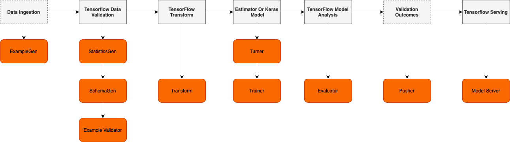

[![MIT License][license-shield]][https://github.com/neemiasbsilva/mlops-with-tensorflow-extends/blob/main/LICENSE]
[![LinkedIn][linkedin-shield]][https://www.linkedin.com/in/neemias-bucéli-1836abb8/]

 

  
  <h3 align="center"A TensorFlow Extended Approach for MLOps</h3>
  

    Apply tfx in some ML problems (eg. speech recognition, probabilist, image recognition) using MLops concepts.
     
    <a href="https://github.com/othneildrew/Best-README-Template"><strong>Explore the docs »</strong></a>
     
     
    <a href="https://github.com/othneildrew/Best-README-Template">View Demo</a>
    ·
    <a href="https://github.com/neemiasbsilva/mlops-with-tensorflow-extends/issues">Report Bug</a>
    ·
    <a href="https://github.com/neemiasbsilva/mlops-with-tensorflow-extends/issues">Request Feature</a>
  

