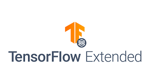
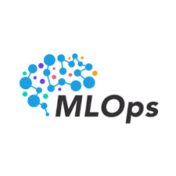

[![TensorFlow][tensorflow-shield]][tensorflow-url]
[![Keras][keras-shield]][keras-url]
[![MIT License][license-shield]][license-url]
[![LinkedIn][linkedin-shield]][linkedin-url]

<!-- PROJECTS LOGO -->
 

  
  <h3 align="center">A TensorFlow Extended Approach for MLOps</h3>
  

    Apply tfx in some ML problems (eg. speech recognition, probabilist, image recognition) using MLops concepts.
     
     
    <a href="https://github.com/neemiasbsilva/mlops-with-tensorflow-extends/issues">Report Bug</a>
    ·
    <a href="https://github.com/neemiasbsilva/mlops-with-tensorflow-extends/issues">Request Feature</a>
  

 

  
Table of Contents

  <ol>
    <li>
      <a href="#about-the-project">About The Project</a>
    </li>
  </ol>

## About The Project

[![Corresponding TFX libraries][tfx-libraries]](https://www.tensorflow.org/tfx?hl=pt-br)

[license-shield]: https://img.shields.io/github/license/Ileriayo/markdown-badges?style=for-the-badge
[license-url]: https://github.com/neemiasbsilva/mlops-with-tensorflow-extends/blob/main/LICENSE.txt
[linkedin-shield]: https://img.shields.io/badge/linkedin-%230077B5.svg?style=for-the-badge&logo=linkedin&logoColor=white
[linkedin-url]: https://www.linkedin.com/in/neemias-bucéli-1836abb8/
[tensorflow-shield]: https://img.shields.io/badge/TensorFlow-%23FF6F00.svg?style=for-the-badge&logo=TensorFlow&logoColor=white
[tensorflow-url]: http://tensorflow.org/
[keras-shield]: https://img.shields.io/badge/Keras-%23D00000.svg?style=for-the-badge&logo=Keras&logoColor=white
[keras-url]: https://www.tensorflow.org/guide/keras?hl=pt-br
[tfx-libraries]: reports/figures/tfx-components.png
